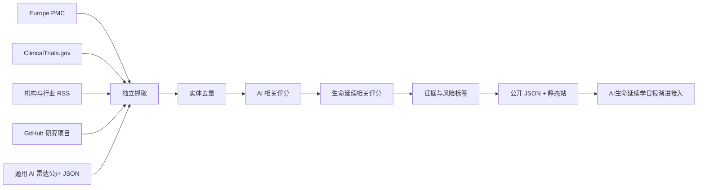

# 爱窝啦 AI生命延续学雷达

独立的 AI × 长寿研究信号雷达。每小时完整接入通用 AI 雷达的公开来源，并叠加论文数据库、临床试验注册库、研究机构 RSS 和 GitHub 项目。网站默认展示去重后的全部信息源，也保留可解释的 AI × 生命延续“双相关”严格视图。

- 网站：<https://radar.aibioo.cn/>
- AI生命延续学日报：<https://news.aibioo.cn/>
- 通用 AI 雷达：<https://radar.aivora.cn/>
- 爱窝啦主站：<https://www.aivora.cn/>

## 独立边界

这个仓库拥有自己的抓取、评分、归档、测试、GitHub Actions 和 GitHub Pages 部署。它不会读取 AI生命延续学日报的私有数据，也不会依赖日报构建成功。日报只通过外链和以下公开 JSON 渐进接入：

- `data/latest-24h.json`：24 小时双相关信号。
- `data/latest-24h-all.json`：24 小时全部信息源；包含旧版 AI雷达全源和本项目专属源。
- `data/briefing-lite.json`：最多 8 条的轻量摘要。
- `data/source-status.json`：各采集器健康状态。
- `data/topic-stats.json`：主题、研究对象和证据阶段统计。

公开 JSON 使用 `bio-radar-v1` schema。新增字段可以向后兼容地加入；破坏性变更必须升级 schema 版本。

## 数据管线



DOI、PMID、NCT 编号和 GitHub `owner/repo` 优先作为实体键；普通页面使用去跟踪参数后的规范化 URL。单一采集器失败不会阻断其他来源，仍在 24 小时窗口内的归档记录会继续保留。

## 评分边界

网站默认打开“全部信息源”，解决只看到极少量严格交集的问题；用户可随时切换到“AI + 生命延续强相关”。只有同时达到两类阈值的条目才进入 `latest-24h.json`、三分钟简报和严格视图。输出还会标注研究对象、发表阶段、证据类型和风险提示。这里的“高分”表示交叉主题信号较强，不表示治疗有效、适用于人类或具备临床价值。

完整说明见 [methodology.html](methodology.html) 和 [docs/SOURCE_COVERAGE.md](docs/SOURCE_COVERAGE.md)。

## 本地验证

Windows 环境按项目约定把临时目录和工具缓存放到 `D:\CodexCache`：

```powershell
python -m pip install -r requirements-dev.txt
python -m pytest -q -p no:cacheprovider
node --test tests/frontend-core.test.cjs tests/frontend-contract.test.cjs
python scripts/update_longevity_radar.py --output-dir data --window-hours 24 --archive-days 21
python -m http.server 8080
```

## 安全与隐私

- 只使用无需登录的公开来源。
- 不提交 token、Cookie、私有 OPML、邮箱内容或个人健康数据。
- 前端只允许 `http` / `https` 链接，不使用抓取内容写入 `innerHTML`。
- 本站是研究信息索引，不提供医学建议、诊断或治疗指导。

## 许可

[MIT](LICENSE)
